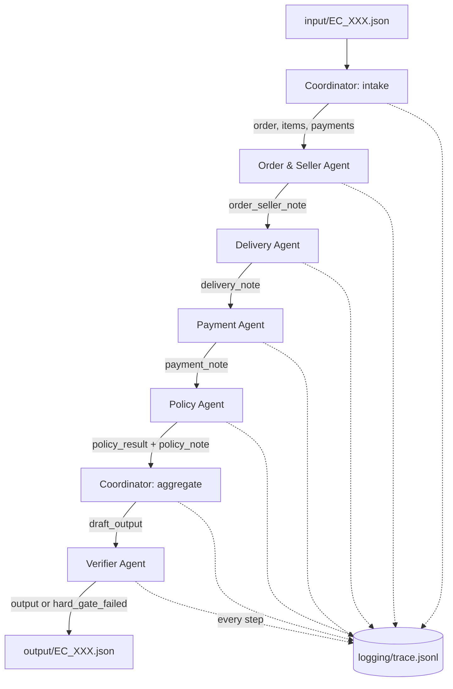

# Architecture — K3 Day 09 Multi-Agent E-commerce Dispute Resolution

## 1. Tổng quan

Hệ thống là một pipeline **LangGraph** tuyến tính gồm 6 agent, xử lý từng case độc lập (`input/EC_XXX.json` → `output/EC_XXX.json`). Mỗi case chạy qua toàn bộ graph một lần; state được handoff qua một `CaseState` (TypedDict) dùng chung, mỗi agent chỉ đọc các field agent trước đã ghi và chỉ ghi field của riêng mình — không có agent nào ôm hết logic trong một prompt duy nhất.

Nguyên tắc thiết kế cốt lõi: **số liệu quyết định điểm số (refund, entity ID, evidence ID, primary issue) luôn được tính bằng Python xác định (deterministic) từ CSV**, không bao giờ để LLM tự suy ra. LLM (Groq, `llama-3.1-8b-instant`, 8B params — dưới mức trần 10B/agent ở mục 9.1 README) chỉ được dùng để **phân tích và diễn giải bằng ngôn ngữ tự nhiên** trên bộ evidence đã được xác minh, phục vụ mục đích "agent thật sự suy luận" và ghi lại trong `trace.jsonl`. Cách này vừa đáp ứng yêu cầu multi-agent có handoff thật, vừa tránh rủi ro LLM hallucination làm sai số tiền hoặc evidence ID (hard gate = 0 điểm).

## 2. Sơ đồ luồng agent



## 3. Vai trò, quyền truy cập dữ liệu và model

| Agent | Vai trò | Dữ liệu được đọc | Ghi vào state | Dùng LLM? |
|---|---|---|---|---|
| **Coordinator** (`intake`) | Nhận case, dùng `claimed_order_id` tra cứu `orders.csv` / `order_items.csv` / `order_payments.csv` qua `DataStore`, nạp evidence gốc cho các agent sau | Toàn bộ 3 CSV liên quan đến 1 order | `order`, `items`, `payments` | Không (điều phối thuần) |
| **Order & Seller Agent** | Xem trạng thái đơn, item, seller; nhận định seller có bàn giao trễ hạn `shipping_limit_date` không | `order.order_status`, `order.order_delivered_carrier_date`, `items[].seller_id/shipping_limit_date` | `order_seller_note` | Có — `llama-3.1-8b-instant` (Groq) |
| **Delivery Agent** | So sánh `order_delivered_customer_date` với `order_estimated_delivery_date` | Chỉ 3 timestamp giao hàng của `order` | `delivery_note` | Có — `llama-3.1-8b-instant` (Groq) |
| **Payment Agent** | Đối soát tổng `payment_value` với tổng item + freight, phát hiện split payment | `payments[].payment_value`, tổng item/freight (từ `items`) | `payment_note` | Có — `llama-3.1-8b-instant` (Groq) |
| **Policy Agent** | Áp `EC_POLICY_V1` (bảng ưu tiên 6 luật, `src/policy.py`) — **quyết định xác định**, không để LLM chọn nhánh; LLM chỉ viết rationale ngắn dựa trên 3 note trên | `order`, `items`, `payments` (để tính rule) + 3 note của agent trước | `policy_result`, `policy_note` | Có (chỉ để narrate, không quyết định) — `llama-3.1-8b-instant` (Groq) |
| **Coordinator** (`aggregate`) | Gộp `policy_result` thành draft output đúng schema mục 6 README (`affected_entities`, `evidence_ids` dựng từ `src/evidence.py`) | `policy_result`, `items`, `payments` | `draft_output` | Không |
| **Verifier Agent** | Hard gate cuối: parse regex từng evidence ID, đối chiếu ngược với `DataStore` xem order/item/payment/seller có thật không, validate schema Pydantic (`CaseOutput`), giới hạn số lượng ID | Đọc lại `DataStore` để xác minh, không đọc gì mới ngoài `draft_output` | `output`, `verifier_issues`, `hard_gate_failed` | **Không, cố ý** — xem mục 4 |

Model duy nhất trong toàn hệ thống: **`llama-3.1-8b-instant`** qua Groq API (8B tham số, khai báo cứng trong `src/config.py`, không đặt trong `.env` — chỉ `GROQ_API_KEY` nằm trong `.env`).

## 4. Vì sao Verifier không dùng LLM

README quy định case có evidence ID sai định dạng hoặc không tồn tại trong CSV bị **hard gate → 0 điểm**. Đây là bước gate cuối cùng trước khi ghi file, nên phải xác định 100% (regex + tra cứu lại `DataStore`), không thể để một LLM 8B "phán đoán" ID có hợp lệ hay không. Coordinator và Verifier là 2 node duy nhất không gọi LLM; cả hai đều là logic điều phối/kiểm chứng thuần, đúng tinh thần README: "không có điểm cho việc chỉ đặt tên nhiều agent nhưng toàn bộ xử lý nằm trong một prompt duy nhất" — ở đây ngược lại, quyết định được tách bạch rõ ràng, mỗi phần chỉ làm đúng một việc.

## 5. Handoff contract (`src/agents/state.py`)

Tất cả agent giao tiếp qua một object `CaseState` (TypedDict) duy nhất được LangGraph truyền tuần tự — đây chính là cơ chế handoff:

```python
class CaseState(TypedDict, total=False):
    case_id, opened_at, customer_request, policy_version   # input gốc
    order, items, payments                                  # Coordinator.intake ghi
    order_seller_note, delivery_note, payment_note           # 3 agent domain ghi
    policy_result, policy_note                               # Policy Agent ghi
    draft_output                                              # Coordinator.aggregate ghi
    output, verifier_issues, hard_gate_failed                 # Verifier ghi
```

Mỗi agent nhận state đầy đủ nhưng **chỉ đọc field thuộc phạm vi của mình** (ví dụ Delivery Agent không đọc `payments`), việc này được kiểm soát ở mức code (mỗi module chỉ import những gì cần) chứ không phải bằng RBAC runtime — phù hợp quy mô bài lab.

## 6. Trace và log

- `logging/trace.jsonl`: mỗi lần chạy `python main.py` sẽ **ghi đè** (không append giữa các lần chạy, đúng README), sau đó mỗi bước của mỗi agent cho mỗi case được append 1 dòng JSON (`case_id`, `agent`, `event`, `data`, `timestamp`), bao gồm cả evidence đưa vào LLM, note LLM trả về, và latency/lỗi nếu có.
- `logging/metadata.json`: ghi model/tham số/framework/runtime sau khi chạy xong, tự động lấy version LangGraph thực tế qua `importlib.metadata`.

## 7. Cách chạy

```bash
pip install -r requirements.txt
cp .env.example .env   # điền GROQ_API_KEY
python main.py                 # chạy toàn bộ 50 case → output/EC_001.json..EC_050.json
python main.py EC_001 EC_014   # chạy nhanh 1-2 case để debug
```

## 8. Rủi ro đã cân nhắc và fallback

- Nếu Groq API lỗi/timeout: `src/llm.py` retry 2 lần với backoff, nếu vẫn fail thì agent trả về note fallback có gắn cờ `llm_unavailable` trong trace — **case vẫn được xử lý và ghi output đầy đủ** vì mọi số liệu quyết định điểm số không phụ thuộc vào note LLM.
- Nếu `claimed_order_id` không có trong `orders.csv`: `order=None`, `items`/`payments` rỗng, Policy Agent rơi vào nhánh mặc định với confidence bị trừ điểm, Verifier sẽ đánh dấu evidence `order:<id>` là `nonexistent_order_evidence` trong `verifier_issues` để dễ audit thủ công (bộ 50 case chính thức không có tình huống này theo README).
